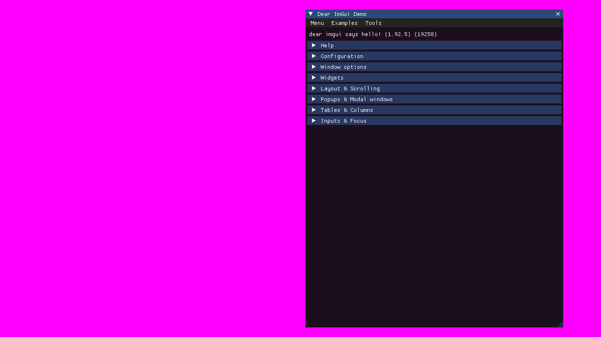

# RSIM - Rogue SIMulator
A simple physics simulator project to apply FDM based methods to simulate in an OpenGL application

## Topics
1. Built using CMake using C++23 (cross-compiled)
2. Solve PDEs using Finite Difference Methods and display the results
3. TODO: Integrate HDF5 to save the results

# Current Status <29-December-2025>
After building and running the application, the UI will display an ImGui Demo window as such:

This is great progress so far!
